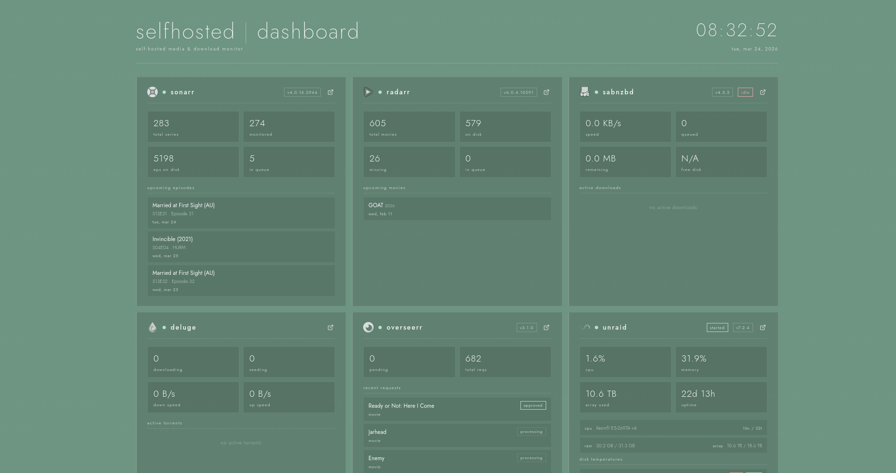

# panel

A cross-platform desktop app for monitoring your self-hosted media and download stack. Inspired by the Colin McRae Rally 2.0 PS1 menu aesthetic.



## Features

- **Sonarr** — series count, episode stats, download queue, upcoming calendar
- **Radarr** — movie count, missing films, queue, upcoming releases
- **SABnzbd** — live download speed, queue, disk space
- **Deluge** — active/seeding torrents, speeds, per-torrent progress
- **Overseerr** — pending requests, recent request cards with posters
- **UnRAID** — CPU/RAM, array state, disk temps, Docker container grid
- **5 themes** — forest, midnight, ember, slate, crimson with live preview
- **Custom display title** — set your own header branding via settings
- **Auto-refresh** — configurable polling interval
- All configuration done inside the app — no config files to edit

## Installation

Download the latest release for your platform from the [Releases](../../releases) page:

| Platform | File |
|----------|------|
| Windows  | `.exe` installer |
| macOS    | `.dmg` |
| Linux    | `.AppImage` (requires FUSE2) or `.tar.gz` |

## First run

On first launch all service cards will show as offline. Click the **settings** button in the footer, enter the URL and API key for each service you run, and hit **save**. The dashboard reinitialises immediately.

Configuration is saved to:

| Platform | Path |
|----------|------|
| Windows  | `%APPDATA%\panel\config.json` |
| Linux    | `~/.config/panel/config.json` |
| macOS    | `~/Library/Application Support/panel/config.json` |

Services you don't use can be left blank — their cards will simply show as offline.

> **Linux note:** The AppImage requires `libfuse2` (`sudo apt install libfuse2` / `sudo pacman -S fuse2`). If you'd prefer not to install it, use the `.tar.gz` release instead — extract it and run `panel` from the extracted folder.

## Building from source

Requires [Node.js](https://nodejs.org) 18+.

```bash
git clone https://github.com/Revise0592/panel-dash
cd panel-dash
npm install
npm start          # run in development
npm run build      # build distributable for your current platform
```

Build output goes to `dist/`.

## Tech stack

| Layer | Tech |
|-------|------|
| Shell | Electron |
| Frontend | Vanilla JS (ES modules), no framework |
| Styling | CSS3 custom properties |
| Config | JSON via Node.js `fs` — zero runtime dependencies |
| Packaging | electron-builder |

## License

MIT
